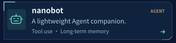
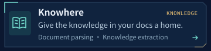
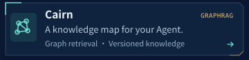
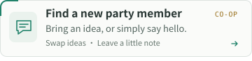

<picture><source media="(prefers-reduced-motion: reduce)" srcset="assets/quantum-pier-still.png"></picture>

### >_ San_Check’s save point

Building Agents, connecting knowledge, occasionally duelling bugs.<br>
`GraphRAG` `Agent` `RL` · [简体中文 ↗](README.md)

**`$ ls ~/playground`**　Pick a quest. Have a look around ↓

<p>
  <a href="https://github.com/redai-studio/Relax"><picture><source media="(prefers-color-scheme: dark)" srcset="assets/relax-en-dark.svg"></picture></a>
  <a href="https://github.com/HKUDS/nanobot"><picture><source media="(prefers-color-scheme: dark)" srcset="assets/nanobot-en-dark.svg"></picture></a>
  <a href="https://github.com/qxcnm/Codex-Manager"><picture><source media="(prefers-color-scheme: dark)" srcset="assets/codex-manager-en-dark.svg"></picture></a>
  <a href="https://github.com/Ontos-AI/knowhere"><picture><source media="(prefers-color-scheme: dark)" srcset="assets/knowhere-en-dark.svg"></picture></a>
  <a href="https://github.com/xcosmosbox/Cairn"><picture><source media="(prefers-color-scheme: dark)" srcset="assets/cairn-en-dark.svg"></picture></a>
  <a href="https://github.com/xcosmosbox/xcosmosbox/issues/new?template=hello.yml"><picture><source media="(prefers-color-scheme: dark)" srcset="assets/party-en-dark.svg"></picture></a>
</p>

Code at your own pace. Make a friend along the way. [Drop by](https://github.com/xcosmosbox/xcosmosbox/issues/new?template=hello.yml) — peace & love ✌️ · tea first 🍵

<details>
<summary>🎲 Spot Hidden: is that a note on the back of this README?</summary>

#### Save 00 · The unspeakable legacy code

You pick up a note. It contains a single line:

```python
# TODO: Do not touch. The reason is beyond human comprehension.
```

**Choose your investigation:**

<details>
<summary>🔎 Investigate → git blame</summary>

```diff
- Author: an unspeakable Great Old One
+ Author: me, three months ago
```

**Sanity −1. Experience +1.** The eldritch horror was me all along.

</details>

<details>
<summary>🎲 Try your luck → run the tests</summary>

```console
$ pytest -q
100 passed
$ git diff --stat
0 files changed
```

**Ending: critical success.** Nothing changed. The bug vanished. Today, you decide to leave the mysteries of the universe alone.

</details>

<details>
<summary>🍵 Willpower → save, then make tea</summary>

```python
sanity += 1
party.add("you, passing by")
quest.pause(reason="tea is best enjoyed warm")
```

Loot: **hot tea × 1 · new party member × 1**. The code can be saved tomorrow. Live a little today.

</details>

<details>
<summary>🗝️ Before closing the case… turn the note over</summary>

A cybernetic die is taped to the back of the note. The terminal whispers:

> **“Roll it, investigator. Let’s see whether you find the bug—or the bug finds you.”**

```python
from random import randint

san, d100 = 60, randint(1, 100)
print(f"🎲 SAN {san} · 1D100 = {d100:02d}")
if d100 == 1:
    print("Critical success. The Old One offers to fix your code.")
elif d100 == 100:
    print("Fumble. git blame points to your previous life.")
elif d100 <= san:
    print("Check passed. Even the Old One says: tea first 🍵")
else:
    print(f"SAN -{randint(1, 6)}. Your name echoes from the stack.")
```

<sub>Connection closed. One more window lights up across the water.</sub>

</details>

</details>
