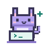

<picture>
  <source media="(prefers-color-scheme: dark)" srcset="assets/pixel-cat-dark.svg">
  
</picture>

### >_ San_Check 的存档点

写点 Agent，连点知识，偶尔跟 bug 对线。 
`GraphRAG` `MCP` `RL` · [English ↗](README.en.md)

| 🕹️ 出没地点 | 正在玩的副本 |
| :-- | :-- |
| 🪨 **[Cairn](https://github.com/xcosmosbox/Cairn)** | 给 Agent 一张知识地图。 |
| 🧘 **[Relax](https://github.com/redai-studio/Relax)** | 大模型的强化学习修炼场。 |
| 🐈 **[nanobot](https://github.com/HKUDS/nanobot)** | 轻装上阵的 Agent 小伙伴。 |
| 🎛️ **[Codex-Manager](https://github.com/qxcnm/Codex-Manager)** | 给模型请求安排个好管家。 |
| 🛰️ **[Knowhere](https://github.com/Ontos-AI/knowhere)** | 把文档拆开，给知识找个家。 |

有想法就来[串个门](https://github.com/xcosmosbox/xcosmosbox/issues/new?template=hello.yml)。代码慢慢写，朋友慢慢交。peace & love ✌️

🎁 路过的话，领个补给再走

掉落：🍵 热茶 × 1 · 🍀 好运 +1 
愿你今天的测试全绿，报错都好懂。`ฅ^•ﻌ•^ฅ`

