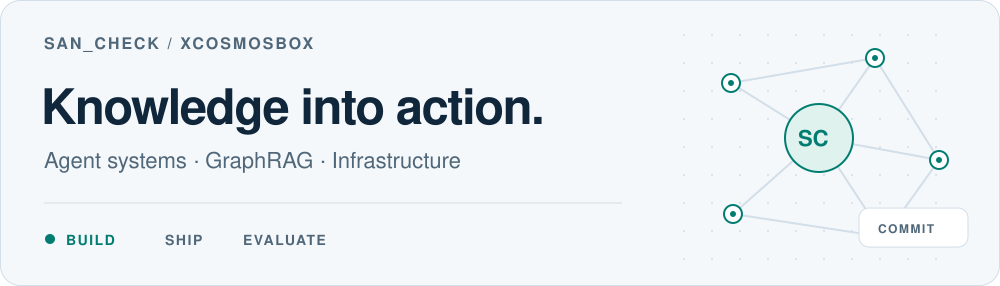
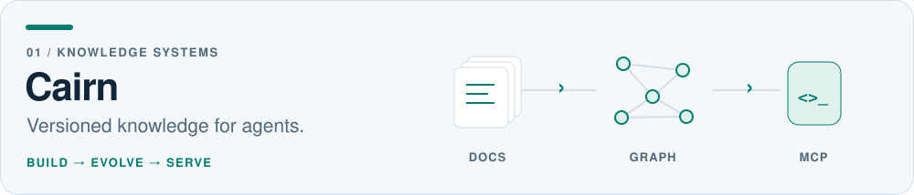
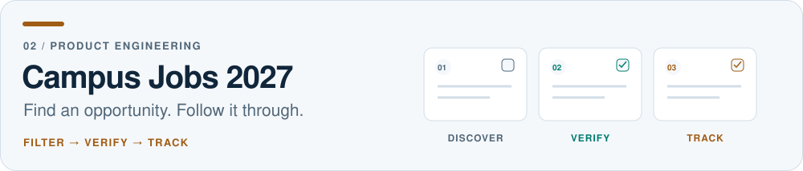

<picture>
  <source media="(prefers-color-scheme: dark)" srcset="assets/hero-dark.svg">
  <source media="(prefers-color-scheme: light)" srcset="assets/hero-light.svg">
  
</picture>

  <a href="README.md">English</a> · <b>简体中文</b>
   
  <a href="#代表作品">代表作品</a> · <a href="#上游开源贡献">开源贡献</a> · <a href="docs/engineering-notes.zh-CN.md">工程笔记</a> · <a href="#一起做点东西">联系我</a>

你好，我是 **San_Check**（`xcosmosbox`）。我构建面向 AI Agent 的知识系统，参与它们背后的基础设施，也把日常遇到的问题做成可以直接使用的产品。

主要方向是 **GraphRAG 与 MCP**、**Agent 基础设施**和**强化学习工程**。最近也在探索可复用 Agent 技能的评测与演化。

## 代表作品

<a href="https://github.com/xcosmosbox/Cairn">
  <picture>
    <source media="(prefers-color-scheme: dark)" srcset="assets/cairn-dark.svg">
    <source media="(prefers-color-scheme: light)" srcset="assets/cairn-light.svg">
    
  </picture>
</a>

**[Cairn](https://github.com/xcosmosbox/Cairn)** 把散落的 Skill 文档构建成可编辑的知识图谱，再通过 MCP 交给 Agent 使用。我围绕它实现了增量更新、人工修改保留，以及支持热切换与回滚的版本化 Bundle 分发。

`Go` `SQLite / FTS5` `MCP` `React / TypeScript`

[看看整体架构 →](https://github.com/xcosmosbox/Cairn#架构) · [看看正确性修复 →](https://github.com/xcosmosbox/Cairn/blob/main/CORRECTNESS.md)

<a href="https://github.com/xcosmosbox/campus-jobs-2027">
  <picture>
    <source media="(prefers-color-scheme: dark)" srcset="assets/campus-dark.svg">
    <source media="(prefers-color-scheme: light)" srcset="assets/campus-light.svg">
    
  </picture>
</a>

**[27届秋招筛选站](https://github.com/xcosmosbox/campus-jobs-2027)** 把机会筛选、来源核验、投递记录和截止时间放进同一个工作区。从游客使用、恢复码、数据导出，到 Docker 自托管，围绕真实求职流程做完整交付。

`TypeScript` `SQLite / D1` `Docker`

[直接使用 →](https://autumn27-screening.ottofeng00.chatgpt.site) · [自己部署 →](https://github.com/xcosmosbox/campus-jobs-2027/blob/main/docs/self-hosting.md)

## 上游开源贡献

我也参与自己使用的工具。下面展示的是**我已合并到上游的具体改动**，项目本身由各自的维护者维护。

| 项目 | 我做了什么 | 代码与讨论 |
| :-- | :-- | :-- |
| **[nanobot](https://github.com/HKUDS/nanobot)** | 网关后台进程控制，以及 systemd / launchd 服务集成。 | [#1854](https://github.com/HKUDS/nanobot/pull/1854) |
| **[Relax](https://github.com/redai-studio/Relax)** | 同步 RLOO 训练支持，包括 advantage、policy loss、参数约束和分布式测试。 | [#205](https://github.com/redai-studio/Relax/pull/205) |
| **[Codex-Manager](https://github.com/qxcnm/Codex-Manager)** | 有界请求内容后台写入，以及按清理代次区分新旧数据，保护清空后新写入的记录。 | [#496](https://github.com/qxcnm/Codex-Manager/pull/496) · [#498](https://github.com/qxcnm/Codex-Manager/pull/498) |
| **[Knowhere](https://github.com/Ontos-AI/knowhere)** | HTML 文档解析适配器，复用现有的结构化解析流水线。 | [#181](https://github.com/Ontos-AI/knowhere/pull/181) |

[浏览我已合并的公开上游 PR →](https://github.com/pulls?q=is%3Apr+author%3Axcosmosbox+is%3Amerged+is%3Apublic+-user%3Axcosmosbox)

## 我怎样做工程

- **让知识能长期维护。** 保留人工修改和来源，为 Agent 消费的知识提供明确版本。[Cairn 的设计 →](https://github.com/xcosmosbox/Cairn#核心设计)
- **沿着失败路径思考。** 关注内存边界、背压、重启恢复，以及并发清理时的数据安全。[请求日志案例 →](docs/engineering-notes.zh-CN.md#让请求日志离开转发热路径)
- **把评测边界说清楚。** 明确支持的配置，直接测试生产实现。[RLOO 实现笔记 →](docs/engineering-notes.zh-CN.md#把强化学习算法的实现边界写清楚)

## 早期作品

| 项目 | 探索内容 |
| :-- | :-- |
| [wechaty-PaimonBot](https://github.com/xcosmosbox/wechaty-PaimonBot) | TypeScript 聊天机器人与模块化 Python 工具，是我探索工具调用助手的早期作品。 |
| [TinyJSON](https://github.com/xcosmosbox/TinyJSON) | 用 C++ 实现 JSON 解析。 |
| [Ukkonen · BWT · LZ77](https://github.com/xcosmosbox/Ukkonen_BWT_LZ77) | 用 Python 实现后缀树、字符串匹配与压缩算法。 |

## 一起做点东西

欢迎交流 **Agent 系统、知识基础设施，以及从想法到可用产品的工程实践**。开源合作与工作机会也欢迎：[聊聊你的想法 →](https://github.com/xcosmosbox/xcosmosbox/issues/new?template=hello.yml)

这里展示的是部分公开工作。具体实现、验证结果和适用边界，以链接中的仓库和 PR 为准。
